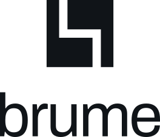

# Brume Brand Kit v2.0

Studio: Londev. Mark: **Cleave**.

**Open `preview.html` first.** Every asset at true size, light and dark, with a
three-step construction demo that shows why the mark is built the way it is.
`BRAND-KIT.md` is the full specification.

## The one thing to know

Cleave is a square opened along a stepped cut. The two pieces are **congruent**:
rotate either 180 degrees about the centre and you get the other. That is why
the Don't list says never rotate the mark. A rotated Cleave is identical to an
unrotated one, so rotating it communicates nothing and just looks like a bug.

Three numbers govern the whole system, all measured off Archivo Medium rather
than chosen:

| | Value | Origin |
|---|---|---|
| Module | 3 | stem weight, 0.088em, from the `l`. The cut is one module wide. |
| Radius | 9 | half the bowl, 0.55em, from the `o` |
| Live area | 24 | ascender height, so mark and wordmark match in any lockup |

## What is where

```
BRAND-KIT.md              full specification, all SVG inline
preview.html              visual contact sheet, open this first

assets/svg/               THE SOURCES. Five files, currentColor.
  mark.svg                primary, 32 canvas, 3-unit cut
  mark-sm.svg             redraw for 16 and 24, cut opened to 4
  wordmark.svg            Archivo Medium, outlined
  lockup-h.svg            horizontal
  lockup-v.svg            stacked

assets/svg/generated/     colourways + tiles. Regenerate, don't hand-edit.
  favicon.svg             adaptive: follows prefers-color-scheme on its own
  tile-dark.svg           Ink field, Paper mark, for OS icon slots
assets/icons/             44 icons for the browser chrome
  cleave.svg              the mark itself, filled. Not a UI icon.
assets/png/               45 rasters, incl. apple-touch-icon / icon-192 / icon-512
assets/ico/               favicon.ico  brume.ico  (16 24 32 48 64 128 256 each)
assets/css/tokens.css     colour, type and geometry tokens
tools/                    kit.py (mark) + icons.py (set) + 4 generators
```

## Wiring it up

```html
<link rel="stylesheet" href="assets/css/tokens.css">
<link rel="icon" href="assets/svg/generated/favicon.svg">
<link rel="icon" sizes="any" href="assets/ico/favicon.ico">
<link rel="apple-touch-icon" href="assets/png/apple-touch-icon.png">
```

```css
.logo { color: var(--fg); }   /* the SVG inherits it via currentColor */
```

Tauri:

```json
"bundle": { "icon": ["assets/ico/brume.ico", "assets/png/icon-512.png"] }
```

GitHub README, the one place you need the hard-coded colourways because GitHub
strips CSS from inline SVG:

```html
<p align="center">
  <picture>
    <source media="(prefers-color-scheme: dark)" srcset="assets/svg/generated/lockup-v-paper.svg">
    
  </picture>
</p>
```

## Two rules that are easy to get wrong

1. **The favicon is a different drawing, not a downscale.** 16 and 24 use
   `mark-sm.svg`, where the cut opens from 3 units to 4 so it survives
   antialiasing. 32 and above use `mark.svg`. Both `.ico` files already do this
   internally. Keep the crossover at 32 if you export new sizes.

2. **Clear space is 3 modules**, which is `0.375 x` the rendered mark height. A
   32px mark needs 12px of nothing around it. It scales correctly at any size
   because the module scales with the mark.

## Regenerating

```
python3 tools/kit.py       # all SVG, from the geometry constants
python3 tools/raster.py    # PNG + ICO          (needs cairosvg, Pillow)
python3 tools/preview.py   # preview.html
python3 tools/docs.py      # BRAND-KIT.md
python3 tools/audit.py     # icon conformance; exits non-zero on failure
```

### Adding an icon

Add it to `ICONS` in `tools/icons.py`, then run `tools/audit.py`. It checks every
straight segment against the angle rule (90 always, 45 only for direction, arcs
only for genuinely round objects), computes exact arc bounding boxes to confirm
the ink stays inside the live area, flags anything too small to read, and catches
two icons that have ended up with identical paths.

`tools/kit.py` holds the mark and `tools/icons.py` holds the set. The wordmark travels with it as baked
outlines in `tools/wordmark.json`, so the kit rebuilds with no font files and no
network access. `BRAND-KIT.md` is generated from the same geometry, so the spec
cannot drift from the assets.
